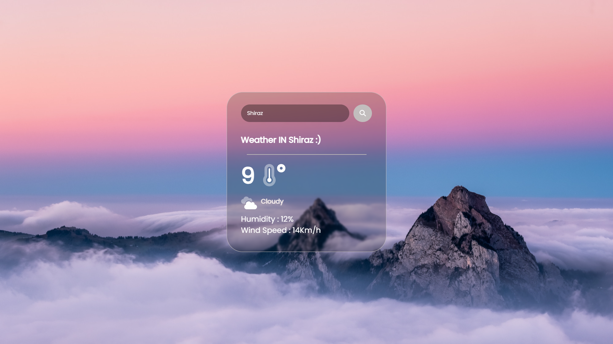

# Weather App mini project 😊⛅
---
- The background of this project changes randomly 👌✨
- The information is not taken from the API, but the information is in the form of an array in the ```main.js``` file. This was just a project to practice the JavaScript language :) ✅




# Font ✍🏻 :
## To embed a font, copy the code into the <head> of your html :
```Html
<link rel="preconnect" href="https://fonts.googleapis.com">
<link rel="preconnect" href="https://fonts.gstatic.com" crossorigin>
<link href="https://fonts.googleapis.com/css2?family=Poppins&display=swap" rel="stylesheet">
```
## CSS rules to specify families :
```Css
font-family: 'Poppins', sans-serif;
```
---
[Instagram](https://instagram.com/abbashz_ir) | [Telegram](https://t.me/A_hz81)